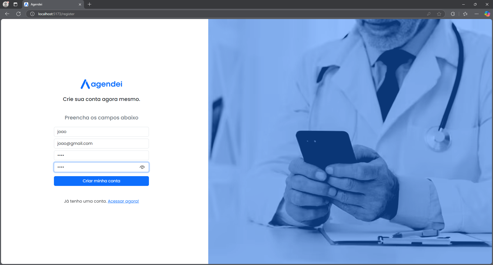
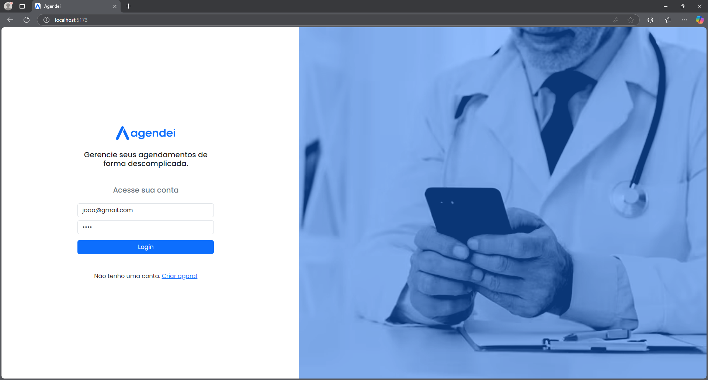
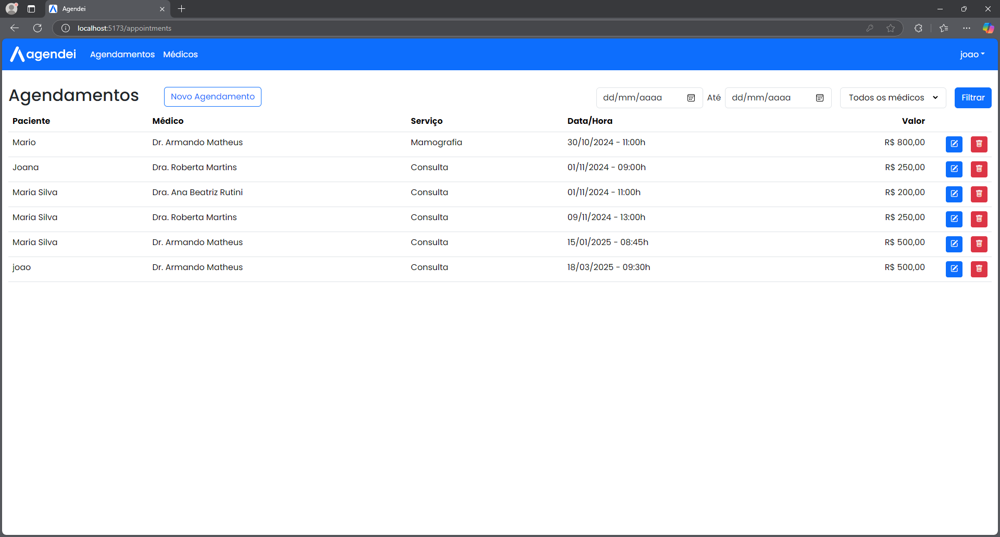
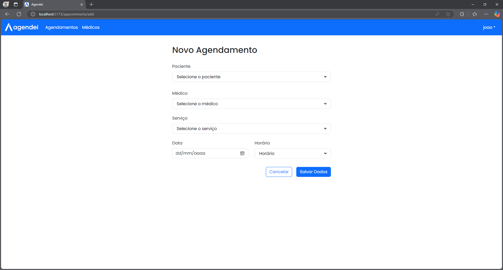
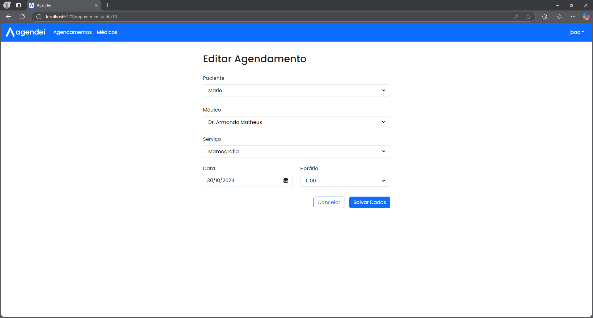

# 🏥 Agendei - Sistema de Agendamento Médico (Web) [](https://nodejs.org/) [](LICENSE)

### 🚀 Visão Geral

Sistema completo para agendamento de consultas médicas, composto por:

- 📱 **Aplicativo Mobile** (Pacientes)
- 🖥️ **Painel Admin** (Gestores)
- 🚀 **Backend** (API RESTful)

Este repositório contém o **Frontend** web do sistema, desenvolvido para fornecer uma interface moderna e intuitiva para administradores.

## ✨ Características do Projeto

✅✔ Visualização de Consultas – Permite que administradores visualizem todas as consultas agendadas.
<br>
✅✔ Gerenciamento de Agendamentos – Interface para editar e cancelar consultas.
<br>
✅✔ Autenticação Segura – Integração com o backend para autenticação de administradores.
<br>
✅✔ Interface Moderna – Desenvolvida com React e Vite, garantindo uma experiência fluida e responsiva.
<br>
✅✔ Confirmação de Ações – Utilização de react-confirm-alert para confirmar ações críticas, como exclusão de consultas.

## 🛠️ Tecnologias Utilizadas

### Backend

- **React** – Biblioteca JavaScript para construção de interfaces de usuário.

- **React Router DOM** – Gerenciamento de rotas no frontend.

- **Axios** – Cliente HTTP para comunicação com o backend.

- **React Confirm Alert** – Biblioteca para exibir caixas de diálogo de confirmação.

- **Vite** – Ferramenta de build rápida para desenvolvimento moderno.

## 🛠️ Ferramentas de Desenvolvimento

- **ESLint** – Linting para garantir a qualidade do código.

- **TypeScript** – Adiciona tipagem estática ao JavaScript (opcional, se configurado).

- **Vite** – Ambiente de desenvolvimento rápido e eficiente.

## Como Rodar o Projeto Localmente

### Pré-requisitos

- Node.js (versão 18 ou superior)
- npm ou yarn (gerenciadores de pacotes)

### Passos

1. Clone o repositório:
   ```bash
   git clone https://github.com/JPerrut/agendei-web.git
   ```
2. Acesse a pasta do projeto:
   ```bash
   cd agendei-web
   ```
3. Instale as dependências:
   ```bash
   npm install
   ```
4. Inicie o servidor de desenvolvimento:
   ```bash
   npm run dev
   ```
5. Acesse o projeto no navegador:
   ```bash
   http://localhost:5173
   ```

## Contribuição

### Contribuições são bem-vindas! Siga os passos abaixo:

1. Faça um fork do projeto.
2. Crie uma branch para sua feature (`git checkout -b feature/nova-feature`).
3. Commit suas mudanças (`git commit -m 'Adiciona nova feature'`).
4. Faça push para a branch (`git push origin feature/nova-feature`).
5. Abra um Pull Request.

## Licença

Este projeto está licenciado sob a <a href="https://opensource.org/license/mit">MIT License</a>.

## Contato

### Se tiver dúvidas ou sugestões, entre em contato:

Nome: João Perrut <br>
Email: joaoperrutc@gmail.com <br>
Linkedin: https://www.linkedin.com/in/perrut/

### Tela de Cadastro



### Tela de Login



### Tela de Consultas



### Tela de Novos Agendamentos



### Tela de Editar Agendamentos


